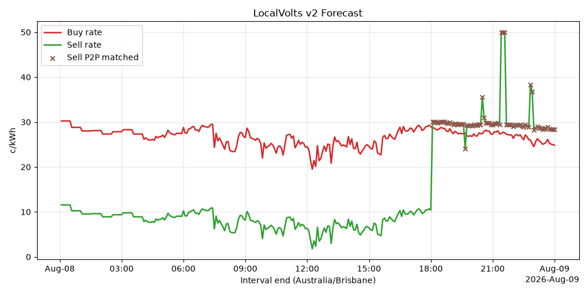

# LocalVolts v2 for Home Assistant

A Home Assistant custom integration for LocalVolts interval pricing, costs, P2P information, market statistics, and an in-memory forecast chart. LocalVolts v2 is the primary source. The optional LocalVolts v1 connection supplies comparison and reconciliation data only.

> **Important:** The LocalVolts v2 behavior described here is based on the reverse-engineered `API_V2_SPECIFICATION.md` supplied with this integration task, not official LocalVolts documentation. Validate billing-critical conclusions against LocalVolts documentation and invoices.

## Installation

### One click, using a My Home Assistant link

[](https://my.home-assistant.io/redirect/hacs_repository/?owner=purcell-lab&repository=localvolts_v2&category=integration)

Selecting the badge above opens this repository directly in HACS on your own Home Assistant instance, so you can skip the manual custom repository steps. Then select **Download**, restart Home Assistant, and add the integration from **Settings > Devices & services**.

### HACS custom repository, added manually

1. In HACS, open the three-dot menu and choose **Custom repositories**.
2. Add `https://github.com/purcell-lab/localvolts_v2` with category **Integration**.
3. Download **LocalVolts v2**.
4. Restart Home Assistant.
5. Go to **Settings > Devices & services > Add integration** and select **LocalVolts v2**.

## Setup

The UI config flow asks for the following values:

- **API Key**. Enter either the raw key or `apikey <key>`. The integration normalizes the value before sending the required `Authorization` header.
- **Partner ID**. The partner ID paired with that key.
- **NMI**. The NMI that the key and partner ID are authorized to access.

That is the whole form. One credential pair reaches both payloads.

Earlier versions asked for a second, separate v1 pair, on the understanding that a v1 key was not valid for v2 and a v2 key was not valid for v1. The v1 payload is served by the v2 host under the v1 path, and the v2 credential authenticates it. Checked on 2026-08-09 over a 23 hour window, `api2.localvolts.com/v1` with the v2 credential and `api.localvolts.com/v1` with a separate v1 credential both returned 277 records carrying the same 49 fields, and every field of every record matched except `lastUpdate`, a response stamp that differed by seven seconds because the two calls were not simultaneous.

Existing installations are migrated automatically. The stale second pair is removed from storage on upgrade, no entity is affected, and nothing needs to be reconfigured.

The integration verifies connectivity by calling `/version`, then checks the supplied NMI through the v2 interval endpoint. If the v1 comparison fetch fails, the other entities continue to update and the comparison sensor stays unavailable until it returns.

Use the integration's **Configure** action after setup to change the polling interval. The default is 300 seconds, matching the documented five-minute interval granularity. The minimum is 60 seconds.

## Entities

All entities are grouped under one device named `LocalVolts v2`. The device name deliberately omits the NMI, because the device name is used to generate every `entity_id` and a meter identifier is not something to leak into screenshots or shared dashboards.

| Entity | Purpose |
|---|---|
| Current Buy Rate | Current `Buy` import `rateAllVar` in c/kWh. Attributes include the current interval components and the full forward Buy forecast. |
| Current Sell Rate | Current `Sell` export `rateAllVar` in c/kWh. Attributes include the current interval components and the full forward Sell forecast. |
| Daily Cost | Sum of today's settled Buy `amountAll` records. |
| Daily Earnings | Sum of today's settled Sell `amountAll` records. This represents total export interval earnings, not only P2P-matched value. |
| Export P2P Proportion | Current Sell `proportionP2P` as the API's raw fraction from 0 to 1. This entity intentionally uses export direction. |
| Market Participants | `active_loads + active_generators` from the market-wide P2P snapshot. The full market statistics object is in attributes. |
| V1-V2 Daily Cost Delta | Today's v1 `costsAll` minus v2 settled Buy `amountAll`, with both totals in attributes. |
| Forecast Chart camera | Cached two panel PNG. Prices on top, volumes and matched share below. |

The Current Buy Rate and Current Sell Rate forecast attributes contain compact objects with `intervalEnd`, `time`, `rateAllVar`, `volume`, `amountAll`, `proportionP2P`, `flexUp`, and `quality` for use in templates and automations.

### Single signal sensors

Thirteen further sensors publish one field each, in the shape an energy optimizer's forecast parser expects: a `forecast` attribute holding a list of `{"time", "value"}` mappings plus a unit on the entity. Each is named for the API direction and field it reads, rather than for any particular consumer.

Six of them are prices, three per direction. Every interval settles in two parts, the share a peer took and the share the market settled, so each direction has a peer matched rate, a spot rate, and the effective rate that blends them.

| Entity | Unit | Direction | Field |
|---|---|---|---|
| Buy Rate All Var | `$/kWh` | Buy | `rateAllVar`, the blend |
| Sell Rate All Var | `$/kWh` | Sell | `rateAllVar`, the blend |
| Buy P2P Matched Cost | `$/kWh` | Buy | `matchedCost` over matched volume |
| Sell P2P Matched Cost | `$/kWh` | Sell | `matchedCost` over matched volume |
| Buy Spot Rate | `$/kWh` | Buy | `spotCost` over unmatched volume |
| Sell Spot Rate | `$/kWh` | Sell | `spotCost` over unmatched volume |
| Buy Flex Up | `$/kWh` | Buy | `flexUp` |
| Buy P2P Proportion | `%` | Buy | `proportionP2P` |
| Sell P2P Proportion | `%` | Sell | `proportionP2P` |
| Buy P2P Matched Power | `kW` | Buy | `volume` times `proportionP2P` |
| Sell P2P Matched Power | `kW` | Sell | `volume` times `proportionP2P` |
| Buy Volume Power | `kW` | Buy | `volume` |
| Sell Volume Power | `kW` | Sell | `volume` |

Every peer matched entity carries `P2P` in its name, so a peer signal is distinguishable from an ordinary rate or volume at a glance.

The three prices in a direction are not independent. `rateAllVar` is already the blend of the other two, weighted by `proportionP2P`, so adding a leg to the same optimizer field as the effective rate double counts it. Choose one.

Two cautions on the derived rates. Both are energy only and exclude the import network and retail layer, so an import matched rate reads about 17.5 c/kWh below a delivered rate quoted by the trading portal. And the spot rates are sound on forecast rows but only indicative once an interval settles, which means the state of those two entities is the weaker number while the forecast attribute is the sound one. Both are quantified in the [peer to peer forecast notes](docs/p2p-forecast.md).

A matched rate is `none` when nothing matched and a spot rate is `none` when the interval matched in full. Neither is reported as zero, which would read as free energy.

Three conventions are deliberate.

Prices are in `$/kWh`, not the API's `c/kWh`. Optimizers that accept a currency prefix on a per-energy unit would read `c/kWh` as dollars, overstating every price a hundredfold and relabelling their own cost outputs.

Points are stamped at the interval **start**, derived from `intervalEnd` less the interval duration, and each sensor declares `interpolation_mode: previous`. A value stamped at its own interval end would otherwise take effect one interval late.

`volume` is converted from metered kWh to average kW. Note that forward `volume` is a carry forward of past metering rather than a site capability, so it should not be wired to a power limit.

`flexDown` is not published. It was the exact negation of `flexUp` in all 1730 records of the validation window, so negate `Buy Flex Up` if the opposite sign is wanted.

If your optimizer sums every entity assigned to a field rather than choosing between them, adding one of these prices alongside an existing price series in the same field will double count.

### Forecast chart

The camera entity renders the forecast locally in Home Assistant and caches the PNG in memory. It is two panels on a shared time axis.

The upper panel carries the six price signals. Buy is warm and sell is cool, so direction reads from colour. The effective rate is solid and the two legs it blends are dashed and dotted, so the blend reads from line style: each effective rate sits between its own spot and matched legs, pulled toward whichever one took more of the interval. The flex up incentive rides on the same axis, thin and grey, because it is also a c/kWh rate.

The lower panel carries the remaining forecasts across twin axes, power in kW on the left and matched share as a percentage on the right.



Peer matched series carry point markers rather than lines alone. Matching arrives as isolated five minute intervals, so a match with nothing either side draws no line segment and would otherwise be invisible. Intervals where a quantity is undefined are drawn as a break in the line rather than dropped, because dropping them lets the plot join across the gap and draw a match that never happened.

Rendered from a real 24 hour window at a single residential premises in south east Queensland. The chart carries no meter identifier, so it is safe to share.

## Services

### Refresh forecast

Forces an immediate refresh of one entry or all loaded LocalVolts entries.

```yaml
service: localvolts_v2.refresh_forecast
data:
  entry_id: YOUR_CONFIG_ENTRY_ID
```

Omit `entry_id` to refresh every loaded LocalVolts entry.

### Get cheapest forecast window

Returns the lowest-average contiguous five-minute forecast window. Select `Buy` for import prices or `Sell` for export prices. This service requires a response variable when called from an automation or script because it uses Home Assistant service response data.

```yaml
service: localvolts_v2.get_cheapest_window
data:
  entry_id: YOUR_CONFIG_ENTRY_ID
  direction: Buy
  hours: 2
response_variable: localvolts_window
```

The response contains a `windows` list. Each result includes NMI, start/end timestamps, interval count, average `rateAllVar`, unit, and direction.

## Why optional v1 data?

Use v2 for invoice-oriented totals. Per the supplied reverse-engineered specification, `amountAll` and `amountFixed` are the more complete cost values, including information v1 misses such as P2P premium and part of the daily fee.

The v1 feed can still be useful as a comparison source. Its `costsFlexUp` and `costsAllVarRate` support a spot-plus-energy-plus-certificate rate reconciliation that was observed to match invoices in tested intervals, while v2 `flexUp` and `rateAllVar` were not observed to provide that same reconciliation. The v1 comparison sensor should therefore be treated as diagnostic, not as the authoritative daily cost.

Known v1 caveats from the supplied reverse-engineered comparison notes:

- `costsAll` undercounts total cost. It misses the P2P premium entirely and approximately 24.7 cents per day of the LocalVolts daily fee in the observed data.
- v1 uses a percent string for `importsAllZeroEE`; v2 uses a zero-to-one fraction for the comparable `zeroEE` field. Do not mix these units in templates.
- v1 and v2 are two views of the same account, not two accounts. One credential pair reaches both.
- v1 refuses any window of 24 hours or wider, including a bare pair of dates one day apart, and answers `'to' date cannot be more than 24 hours after 'from' date or current time`. v2 accepts the multi day window the coordinator uses, so the two clients are given different windows. v1 is asked for the local day only, which is all the comparison sensor needs.

## API behavior and limitations

The following items come from the supplied reverse-engineered `API_V2_SPECIFICATION.md`:

- Use `https://api2.localvolts.com` for v2. The v1 host is `https://api.localvolts.com`.
- Authenticated requests require both `Authorization: apikey <KEY>` and `partner: <PARTNER_ID>` headers.
- v2 may return `HTTP 200` with an array error body such as `Not Authenticated` or `Not Authorised`. The integration inspects successful bodies for these errors.
- v2 historical data is limited to approximately three days and forecast data is limited to approximately one day ahead, usually through the end of the current local day. The coordinator requests from two local calendar days ago through tomorrow.
- `spotCost` is unreliable on settled `Exp` and `Act` intervals. The supplied specification observed it inflated by about 1050 times. That inflation did not appear in a sample of 83 settled intervals taken on 2026-08-10, where the values looked plausible, but they still failed a reconciliation that all 206 forecast intervals of the same day passed. Treat `spotCost` as forecast-only either way.
- `rateAllVar` is the proportion weighted blend of the peer matched rate and the spot rate, plus a constant variable network and retail layer on import. Measured on forecast rows only. See the [peer to peer forecast notes](docs/p2p-forecast.md) for the arithmetic and the residuals.
- `amountAll = amountVar + amountFixed + amountDemand` and `rateAllVar = amountVar / volume * 100` were verified in the supplied specification.

For how peer matched export data is carried, which endpoint provides a forward view of it, and which entity to read for what, see [Peer to peer forecast, endpoint and sensor mapping](docs/p2p-forecast.md).

## Development

Run the test suite from the repository root:

```bash
pip install pytest pytest-asyncio pytest-homeassistant-custom-component "matplotlib>=3.7.0" pyyaml
pytest tests/ -v
```

The suite covers the config flow paths, coordinator behaviour including the stale data fallback and optional v1 handling, and sensor state and attributes. It passes against Home Assistant 2026.8.0. It does not exercise a live Home Assistant instance with real LocalVolts credentials, so verify the integration in your own environment before relying on it.

## Branding

The icon and logo in `custom_components/localvolts_v2/brand/` are generic energy themed marks created for this repository so that HACS brand validation passes. They are not official LocalVolts branding. Home Assistant only shows integration icons in its own UI for integrations listed in the [Home Assistant brands repository](https://github.com/home-assistant/brands), so a separate submission there is needed for in-app icons.

## Privacy and credentials

Credentials are stored in the Home Assistant config entry. The integration sends them only to the LocalVolts API hosts needed for the configured v2 and optional v1 feeds. The forecast chart is rendered locally in Home Assistant and cached in memory, and its title carries no meter identifier so it can be shared or screenshotted safely.
