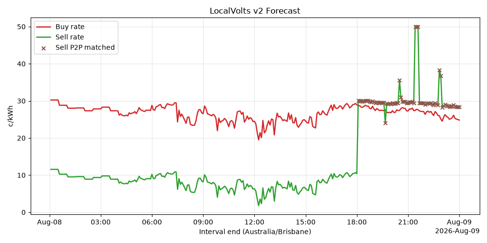

# LocalVolts v2 for Home Assistant

A Home Assistant custom integration for LocalVolts interval pricing, costs, peer to peer information, market statistics, and a forecast chart rendered locally.



Six price signals on top, three per direction, because every interval settles in two parts: the share a peer took and the share the market settled. The effective rate is the blend of the two, so each solid line sits between its own dashed and dotted legs. Volumes and matched share sit below on a shared time axis.

Setup takes one API key, one partner ID, and your NMI.

> **Important:** Official LocalVolts documentation is now committed at [docs/api/](docs/api/), as [the API Guide 0.9.8 PDF](docs/api/LvAPI_20260715.pdf) with [a markdown transcription](docs/api/lv-api-guide-0.9.8.md) beside it. That guide is the reference for what the API promises. A good deal of the behavior this integration relies on is not in it, and comes instead from field measurement against a single site. Anything below that is measured rather than documented is labelled as such. [docs/api/endpoint-audit.md](docs/api/endpoint-audit.md) sets out exactly which documented endpoints and fields this integration surfaces, which it does not, and where measured behavior and the guide diverge. Validate billing-critical conclusions against your own invoices.

## Installation

### One click, using a My Home Assistant link

[](https://my.home-assistant.io/redirect/hacs_repository/?owner=purcell-lab&repository=localvolts_v2&category=integration)

Selecting the badge above opens this repository directly in HACS on your own Home Assistant instance, so you can skip the manual custom repository steps. Then select **Download**, restart Home Assistant, and add the integration from **Settings > Devices & services**.

### HACS custom repository, added manually

1. In HACS, open the three-dot menu and choose **Custom repositories**.
2. Add `https://github.com/purcell-lab/localvolts_v2` with category **Integration**.
3. Download **LocalVolts v2**.
4. Restart Home Assistant.
5. Go to **Settings > Devices & services > Add integration** and select **LocalVolts v2**.

## Setup

The UI config flow asks for the following values:

- **API Key**. Enter either the raw key or `apikey <key>`. The integration normalizes the value before sending the required `Authorization` header.
- **Partner ID**. The partner ID paired with that key.
- **NMI**. The NMI that the key and partner ID are authorized to access.

That is the whole form.

Earlier versions asked for a second, separate v1 pair for a daily cost comparison sensor. Both the second pair and that sensor are gone, and v1 is no longer polled at all. The reasoning is in [the note on why v1 was dropped](#why-v1-was-dropped).

Existing installations migrate automatically. The stale pair is removed from storage and the retired entity is deleted from the registry rather than left showing as unavailable. Nothing needs reconfiguring.

The integration verifies connectivity by calling `/version`, then checks the supplied NMI through the v2 interval endpoint.

Use the integration's **Configure** action after setup to change the polling interval. The default is 300 seconds, matching the documented five-minute interval granularity. The minimum is 60 seconds.

## Entities

All entities are grouped under one device named `LocalVolts v2`. The device name deliberately omits the NMI, because the device name is used to generate every `entity_id` and a meter identifier is not something to leak into screenshots or shared dashboards.

| Entity | Purpose |
|---|---|
| Current Buy Rate | Current `Buy` import `rateAllVar` in c/kWh. Attributes include the current interval components, `emissions`, `zeroEE` and the full forward Buy forecast. |
| Current Sell Rate | Current `Sell` export `rateAllVar` in c/kWh. Attributes include the current interval components, `emissions`, `zeroEE` and the full forward Sell forecast. |
| Daily Cost | Sum of today's elapsed Buy `amountAll` records, in AUD. |
| Daily Earnings | Sum of today's elapsed Sell `amountAll` records, in AUD. This represents total export interval earnings, not only P2P-matched value. |
| Daily Net Cost | Daily Cost less Daily Earnings, in AUD. Goes negative on a day that exports more value than it imports. |
| Yesterday Cost | Previous local day total import cost, published with a settlement completeness account and every interval of the day in its attributes. |
| Yesterday Earnings | Previous local day total export earnings, with the same completeness account and interval detail. |
| Export P2P Proportion | Current Sell `proportionP2P` as the API's raw fraction from 0 to 1. This entity intentionally uses export direction. |
| Market Participants | `active_loads + active_generators` from the market-wide P2P snapshot. The full market statistics object is in attributes. Undocumented: `/v2/market/stats` is not in the API guide, so this sensor has no stated contract and can become unavailable or be withdrawn without notice. It is unavailable whenever the snapshot cannot be fetched. |
| NEM Region | Diagnostic. The NEM region from the customer metadata endpoint, read once at start up. Unknown until the read succeeds. |
| Read Type | Diagnostic. The metering class, for example `Remote Interval`, from the same read. |
| Distribution Loss Factor Code, Network Tariff Code, Circuit, Meter Suffix | Diagnostic, disabled by default. The matching fields from the same read. |
| Forecast Chart camera | Cached two panel PNG. Prices on top, volumes and matched share below. |

### Cost accounting

All five money entities carry the monetary device class and an ISO 4217 unit of `AUD`. That pairing is what makes the frontend render them through the locale's currency format, as `A$4.08` rather than `4.08 AUD`. The unit alone is not enough; without the device class Home Assistant falls back to plain numeric formatting and appends the unit as a suffix.

The three daily entities add the `total` state class with `last_reset` at local midnight. That combination is deliberate:

- Home Assistant excludes the monetary device class from `measurement` long term statistics, so a monetary `measurement` sensor records mean, min and max and never a sum. A month or a year of cost cannot be read back from it.
- `total_increasing` is wrong here because negative prices can make a daily cost fall during the day, which would be read as a meter reset.
- `last_reset` tells the recorder that the return to zero at midnight is a new counting period rather than a fall the size of a whole day.

`amountAll` already includes network, supply and any demand charge. Each money entity exposes the split as `amount_var_today`, `amount_fixed_today` and `amount_demand_today`, and the three reconstruct the total. The fixed component accrues on every interval, so it accumulates on a day with no import at all. There is no separate certificate line in the API, so certificate costs cannot be broken out.

The two Yesterday entities carry no state class at all, which keeps them out of long term statistics. A state class of `total` would record the accumulated growth or decline of the state rather than the state itself, and this value is replaced once a day by an unrelated figure, so those day to day differences describe nothing. `measurement` is not an option either, because Home Assistant does not permit it on a monetary device class. The daily entities already provide the statistics grade accumulation, and the settled days are recorded separately as external statistics, described under [Settled daily long term statistics](#settled-daily-long-term-statistics).

### Settled daily long term statistics

The Yesterday entities cannot themselves carry long term statistics, but the numbers behind them can. The integration writes two external statistic series directly into the recorder, one point per settled local day, stamped to the start of that day:

| Statistic | Contents |
| --- | --- |
| `localvolts_v2:<entry>_cost` | LocalVolts settled daily import cost |
| `localvolts_v2:<entry>_earnings` | LocalVolts settled daily export earnings |

`<entry>` is the lowercased config entry id, so the id carries no account identifier. Both series have `has_sum`, so a chart or a statistics card can read back a week, a month or a year of cost.

What gets written and when:

- Only elapsed local days with every interval present. Today is still running and is left to the Daily entities. A day short of intervals is left out entirely rather than written low, because a chart cannot show that a bar is provisional and a reader would take it at face value.
- Quality is not a condition. A complete day that still holds rows marked `Fcst` is written at face value. Promotion from `Fcst` to `Exp` rewrites only `spotCost`, and across 166 observed promotions `amountAll` did not move, so a `Fcst` row already carries the money. A couple of rows per day never leave `Fcst` at all on this feed, so waiting for a clean quality mix would mean writing almost nothing.
- The fetched window covers the last two days, so a day that firms up later is rewritten in place. Re-importing the same start overwrites the point rather than adding a second one.
- The write is skipped while the totals in the window are unchanged, so a poll every minute does not mean a database write every minute.
- A recorder failure is logged and the poll continues. Statistics are a side effect of the fetch and never cost the entities their data.

The series are separate from the entities. They appear in Developer tools, Statistics under the names above, and they are not the history of `sensor.localvolts_yesterday_cost`.

These totals are forecast grade, and each one says so in its `caveat` attribute. See [the note on settlement and the dollar fields](docs/p2p-forecast.md) for the measurement behind that.

### Yesterday's intervals

Each Yesterday entity publishes the whole of the previous local day as an `intervals` attribute, one row per five minute interval, ordered by `intervalEnd`. Each row carries `intervalEnd`, `quality`, and the fields named in `interval_fields`: `amountAll`, `amountVar`, `amountFixed`, `amountDemand`, `volume`, `rateAllVar`, `proportionP2P` and `matchedCost`. A field the API did not report is published as `null`, never as zero.

The list is complete rather than sampled, so the entity's own total can be checked by adding `amountAll` across the rows. `quality` travels on each row because firmness varies inside a day: a day can be complete and still hold a handful of intervals that never advanced past `Fcst`, and only a per interval quality makes those findable.

`spotCost` is deliberately absent, because publishing it per interval invites wrong arithmetic. Its denominator is the trap, not its scale: it covers only the unmatched share of an interval, so dividing it by full `volume` understates the rate. An earlier revision of this line said the API inflates it by roughly 1050 on `Exp` and `Act` rows. That is wrong and contradicted the fuller explanation further down this file. Across 852 Buy and 653 Sell elapsed intervals pulled live on 2026-08-30, `spotCost / volume` sat at a median of 9.66 and 7.24 c/kWh, which is ordinary NEM spot. The same values divided by 1050 would be 0.009 c/kWh, which is not. `spotCost` is in dollars and is not inflated. See [docs/billing.md](docs/billing.md).

A single day query returns 289 rows per direction, not 288, because the response spans midnight to midnight inclusive. By the interval end convention the row ending at 00:00 belongs to the day before, so the day's own 288 rows are the ones ending after 00:00 and up to and including 00:00 the next day. Summing the raw response overstates the day by one interval, which is visible as a supply charge of 289 units instead of 288. The `intervals` attribute is already resolved to the correct 288.

The list is excluded from the recorder. That exclusion is applied before Home Assistant measures a state against its attribute size limit, so no interval and no field is ever dropped to make the state fit. The attribute does still cross the websocket to every open dashboard on each poll, so a template that only needs the total should read the state rather than reduce the list.

For comparing a month or a year of this against a real invoice, and for what the differences will mean, see [reconciling against an invoice](docs/billing.md).


The Current Buy Rate and Current Sell Rate forecast attributes contain compact objects with `intervalEnd`, `quality`, `rateAllVar`, `volume`, `amountAll`, `proportionP2P`, `flexUp`, `flexDown` and `matchedCost` for use in templates and automations. `intervalEnd` is the end of the interval; the rows carry no `time` key, because on the single signal sensors below `time` means the interval start.

The peer matched rate for an interval, in $/kWh, is `matchedCost / (volume x proportionP2P)`. `matchedCost` is rounded to eight decimal places because off peak intervals are worth a fraction of a cent. `quality` reads `Fcst` on every row today, since the attribute holds forward rows only.

### Single signal sensors

Thirteen further sensors publish one field each, in the shape an energy optimizer's forecast parser expects: a `forecast` attribute holding a list of `{"time", "value"}` mappings plus a unit on the entity. Each is named for the API direction and field it reads, rather than for any particular consumer.

Six of them are prices, three per direction. Every interval settles in two parts, the share a peer took and the share the market settled, so each direction has a peer matched rate, a spot rate, and the effective rate that blends them.

| Entity | Unit | Direction | Field |
|---|---|---|---|
| Buy Rate All Var | `$/kWh` | Buy | `rateAllVar`, the blend |
| Sell Rate All Var | `$/kWh` | Sell | `rateAllVar`, the blend |
| Buy P2P Matched Cost | `$/kWh` | Buy | `matchedCost` over matched volume |
| Sell P2P Matched Cost | `$/kWh` | Sell | `matchedCost` over matched volume |
| Buy Spot Rate | `$/kWh` | Buy | `spotCost` over unmatched volume |
| Sell Spot Rate | `$/kWh` | Sell | `spotCost` over unmatched volume |
| Buy Flex Up | `$/kWh` | Buy | `flexUp` |
| Buy P2P Proportion | `%` | Buy | `proportionP2P` |
| Sell P2P Proportion | `%` | Sell | `proportionP2P` |
| Buy P2P Matched Power | `kW` | Buy | `volume` times `proportionP2P` |
| Sell P2P Matched Power | `kW` | Sell | `volume` times `proportionP2P` |
| Buy Volume Power | `kW` | Buy | `volume` |
| Sell Volume Power | `kW` | Sell | `volume` |

Every peer matched entity carries `P2P` in its name, so a peer signal is distinguishable from an ordinary rate or volume at a glance.

The three prices in a direction are not independent. `rateAllVar` is already the blend of the other two, weighted by `proportionP2P`, so adding a leg to the same optimizer field as the effective rate double counts it. Choose one.

Two cautions on the derived rates. Both are energy only and exclude the import network and retail layer, so an import matched rate reads about 17.5 c/kWh below a delivered rate quoted by the trading portal. And the spot rates are sound on forecast rows but only indicative once an interval settles, which means the state of those two entities is the weaker number while the forecast attribute is the sound one. Both are quantified in the [peer to peer forecast notes](docs/p2p-forecast.md).

A matched rate is `none` when nothing matched and a spot rate is `none` when the interval matched in full. Neither is reported as zero, which would read as free energy.

Three conventions are deliberate.

Prices are in `$/kWh`, not the API's `c/kWh`. Optimizers that accept a currency prefix on a per-energy unit would read `c/kWh` as dollars, overstating every price a hundredfold and relabelling their own cost outputs.

Points are stamped at the interval **start**, derived from `intervalEnd` less the interval duration, and each sensor declares `interpolation_mode: previous`. A value stamped at its own interval end would otherwise take effect one interval late.

`volume` is converted from metered kWh to average kW. Note that forward `volume` is a carry forward of past metering rather than a site capability, so it should not be wired to a power limit.

`flexDown` is not published. It was the exact negation of `flexUp` in all 1730 records of the validation window, so negate `Buy Flex Up` if the opposite sign is wanted.

One more sensor, Flex Up Forecast, pairs both directions on the same row. Its `forecast` attribute is a list of `{"time", "costsflexup", "earningsflexup", "quality"}` mappings in `$/kWh`, where `costsflexup` is the Buy `flexUp` and `earningsflexup` is the Sell `flexUp`, paired on `intervalEnd`. `time` is the interval start, as on the other sensors, and `quality` is the Buy row's value. An interval with either side missing is left out. The state is the current Buy `flexUp`. The attribute is excluded from the recorder. It exists so a consumer that wants both directions reads one entity, and it was requested on issue #31.


If your optimizer sums every entity assigned to a field rather than choosing between them, adding one of these prices alongside an existing price series in the same field will double count.

### Forecast chart

The camera entity renders the forecast locally in Home Assistant and caches the PNG in memory. The chart is [at the top of this page](#localvolts-v2-for-home-assistant).

The upper panel carries the six price signals. Buy is warm and sell is cool, so direction reads from colour. The effective rate is solid and the two legs it blends are dashed and dotted, so the blend reads from line style: each effective rate sits between its own spot and matched legs, pulled toward whichever one took more of the interval. The flex up incentive rides on the same axis, thin and grey, because it is also a c/kWh rate.

The lower panel carries the remaining forecasts across twin axes, power in kW on the left and matched share as a percentage on the right.

The chart spans the current local day so far plus the whole forward horizon, so its width grows through the day and reaches roughly 47 hours just before local midnight. It used to stop at the next local midnight, which kept the axis narrower but only because the forecast itself was being truncated.

Both panels share one axis, so what has already happened sits beside what is still to come, divided by a marker at the current interval. Elapsed intervals are drawn solid and forward ones faded. Opacity carries this rather than line style, because line style is already spoken for encoding which prices blend into which.

The faded part is labelled forward, and the solid part is deliberately not labelled settled. Promotion from `Fcst` to `Exp` rewrites only `spotCost` and leaves the plotted rates and volumes exactly as forecast, so an elapsed interval on this chart is an elapsed forecast, not a measurement. See [docs/settlement.md](docs/settlement.md).

Peer matched series carry point markers rather than lines alone. Matching arrives as isolated five minute intervals, so a match with nothing either side draws no line segment and would otherwise be invisible. Intervals where a quantity is undefined are drawn as a break in the line rather than dropped, because dropping them lets the plot join across the gap and draw a match that never happened.

Rendered from a real 24 hour window at a single residential premises. The chart carries no meter identifier, so it is safe to share.

## Services

### Refresh forecast

Forces an immediate refresh of one entry or all loaded LocalVolts entries.

```yaml
service: localvolts_v2.refresh_forecast
data:
  entry_id: YOUR_CONFIG_ENTRY_ID
```

Omit `entry_id` to refresh every loaded LocalVolts entry.

### Get cheapest forecast window

Returns the lowest-average contiguous five-minute forecast window. Select `Buy` for import prices or `Sell` for export prices. This service requires a response variable when called from an automation or script because it uses Home Assistant service response data.

```yaml
service: localvolts_v2.get_cheapest_window
data:
  entry_id: YOUR_CONFIG_ENTRY_ID
  direction: Buy
  hours: 2
response_variable: localvolts_window
```

The response contains a `windows` list. Each result includes NMI, start/end timestamps, interval count, average `rateAllVar`, unit, and direction.

## Documented API surface

The official guide documents three callable paths in total, plus one legacy path in an appendix.

| Path | Surfaced by this integration |
|---|---|
| `GET /version` | Yes, unauthenticated, as the config flow connectivity check |
| `GET /v2/customer/interval` | Yes, once per coordinator refresh. This is the integration's only data source |
| `GET /v2/customer/metadata` | Yes, once at start up. Six of its fields are kept, see [Customer metadata](#customer-metadata) |
| `GET /v1/customer/interval` | No, by decision. See [why v1 was dropped](#why-v1-was-dropped) |

The integration also calls `GET /v2/market/stats`, which the guide does not document at any
version. It was found by probing and it responds, but it is unsupported, and on a live check on
2026-08-30 every numeric field in it was zero with an empty node list. One sensor, Market
Participants, depends on it.

Every row of that table was confirmed against the production API on 2026-08-30. `/v2/market/interval`,
which the guide removed at version 0.9.0, returns HTTP 404. `/v2/customer/metadata` returns one row
per circuit with all 11 documented fields populated, so the gap is coverage rather than availability.

For field level coverage, which of the guide's 38 interval fields are read, where measured
behavior and the guide diverge, and the full live verification run, see
[docs/api/endpoint-audit.md](docs/api/endpoint-audit.md).

## API behavior and limitations

Documented in the official guide:

- v2 is versioned `v2` in the path. The guide calls `api.localvolts.com` the production host and `api2.localvolts.com` the staging host, then states that the URL for the latest version is `api2.localvolts.com`. The v2 calls this integration makes are served from `api2`.
- Authenticated requests require both `Authorization: apikey <KEY>` and `partner: <PARTNER_ID>` headers, and the word `apikey` is part of the header value.
- Interval data can be requested up to 72 hours into the past and no more than 24 hours into the future, with a stated limit of 24 hours of data at a time for historical calls. Both limits were confirmed live on 2026-08-30 by the rejection messages `Historical data limited to 3 days in the past` and `Future data limited to 1 day(s) ahead`. The forecast really is a rolling 24 hours, not the remainder of the local day. The coordinator requests local midnight two days ago, clamped to 71 hours, through 24 hours from the current interval, as ISO 8601 UTC timestamps.
- The limits apply to `from` and `to` independently rather than to the span between them, so the whole 95 hour window is one request. A single call returning 1140 intervals across 94.92 hours was measured on 2026-08-30, which is wider than the stated 24 hours of data at a time and is accepted anyway.
- `from` and `to` take ISO 8601 UTC timestamps. `to` also accepts the keywords `current`, `nDay(s)` and `nInterval(s)`. The guide's `to=1day` keyword resolves relative to `from`, not to the current interval. Sent alongside a historical `from` it returns only history and no forecast at all, so it is not usable for a rolling horizon. Live, `to=1day` and `to=288intervals` return the same 289 intervals, while `to=2days` is rejected, so the plural in `nDay(s)` never resolves above 1.
- The guide states that an authentication failure returns HTTP 500 with a message. No HTTP 500 was observed live. Retention and horizon errors return HTTP 200 with a single element list of the form `[{"error": ..., "message": ...}]`, which is the same shape already measured for `Not Authenticated`, and malformed query parameters return a real HTTP 400 with a bare object. `api.py` checks both shapes before it checks the status code.
- A settlement price is published by AEMO around 20 seconds after an interval begins.
- `quality` has five values in v2: `Act`, `Sub`, `FSub`, `Exp` and `Fcst`. `Sub` and `FSub` are substituted and finally substituted meter data.

Measured against a single site, not documented anywhere:

- v2 returns `HTTP 200` with an array error body such as `Not Authenticated` or `Not Authorised` rather than a 401. The guide describes authentication failures as HTTP 500 with a message. The integration inspects successful bodies for these errors.
- A bare calendar date in `from` or `to` is accepted and interpreted at site local midnight. The guide specifies a UTC timestamp and says nothing about bare dates. The coordinator no longer sends them.
- Multi circuit sites are untested. The guide splits interval data per circuit, and the integration keys on `direction` only. The one account tested has exactly two circuits, `Import` on register 12 and `Export` on register 72, which map one to one onto `Buy` and `Sell`. If a site returned two `Buy` rows for one interval, for example a controlled load, the daily and yesterday totals would add them, the yesterday interval count would exceed 288, and the Current Buy Rate would be whichever row the API listed first. `tests/test_multi_circuit_rows.py` pins this down. Which behaviour is wanted has not been decided.
- `spotCost` is exact on elapsed rows, following `RRP * 1.0500680 * gst * (1 - proportionP2P) * volume`, which reproduces 99.5% of 567 Buy and 98.9% of 567 Sell intervals to within 0.01% and fits with an R squared of 1.000000. The observed loss factor times 1000 is 1050.07, so an apparent inflation of about 1050 times reads as a `$/MWh` against `$/kWh` unit error rather than a faulty field. The trap that catches people is the denominator: `spotCost` covers only the unmatched share of the interval, so dividing it by full `volume` understates the rate. An earlier revision of this README put that error at 19.38% on export. That figure did not reproduce on re-derivation and has been withdrawn rather than replaced, because the interval to AEMO price alignment it rested on was itself unsound. See [docs/settlement.md](docs/settlement.md).
- `rateAllVar` is the proportion weighted blend of the peer matched rate and the spot rate, plus a constant variable network and retail layer on import. Measured on forecast rows only. See the [peer to peer forecast notes](docs/p2p-forecast.md) for the arithmetic and the residuals.
- `amountAll = amountVar + amountFixed + amountDemand` and `rateAllVar = amountVar / volume * 100` both hold. The guide states the components but not the identities. The first was checked against three days of live data and held on every interval in both directions to within 2e-08 dollars, which is float noise rather than disagreement.
- `amountFixed` carries the fixed daily supply charge, spread evenly across the day. It is one constant value on every import interval, sums to the daily charge over a local day, and is zero on every export interval. `amountDemand` is zero on a site with no demand tariff. So `amountAll` already includes network and fixed charges, and a total built from it is a bill estimate rather than an energy-only figure.

Settlement rewrites `spotCost` and nothing else. Across 48 intervals observed moving from `Fcst` to `Exp` on 2026-08-10, `amountAll`, `amountVar`, `amountFixed`, `amountDemand`, `volume`, `proportionP2P`, `matchedCost` and `rateAllVar` were all unchanged. The dollar fields are written once when the forecast is built and are never revised, so any cost total is forecast grade even after the interval has elapsed.

For how peer matched export data is carried, which endpoint provides a forward view of it, and which entity to read for what, see [Peer to peer forecast, endpoint and sensor mapping](docs/p2p-forecast.md).

If HAEO schedules a battery discharge earlier than the prices justify, see [Troubleshooting](docs/troubleshooting.md).

`zeroEE` is the share of zero emissions energy in the current interval, published exactly as the API returns it. The guide documents the unit as a percent, but `zeroEEUnits` is never returned, and every value seen on 2026-08-30 sat between 0.023 and 1.0, so read it as a 0 to 1 fraction, the same convention as `proportionP2P`.

### Units are checked

Every value in an interval row is paired with a unit string. The integration reads dollars, kWh, c/kWh and g-CO2e, and checks the unit string on each row. If a value arrives in anything else, that value is left unavailable and the mismatch is logged once at warning level, instead of publishing a number that is out by 100 or 1000. A daily or yesterday total with no usable amount is unavailable, not zero. All units have been constant in live responses so far, so this is a defensive check.

### Customer metadata

The integration reads `GET /v2/customer/metadata` once, then retries no sooner than hourly if that fails. It keeps six fields, `Region`, `ReadType`, `DLF`, `Tariff`, `Circuit` and `Suffix`, and discards the rest of the response where it is read (`NMI`, `LNSP`, `TNI`, `MDP` and `Jurisdiction`), so those never reach a sensor, attribute, diagnostic or log. Where the account has several circuits, the distinct values are joined in the order first seen.

`DLF`, `Tariff`, `Circuit` and `Suffix` narrow a site, so their sensors are diagnostic and disabled by default. Enable them from the device page if you want them. Their values are not written to any log. A failing metadata endpoint leaves all six sensors unknown and does not affect pricing.

## Settlement quality and what the totals are worth

`Act` quality was never observed once in roughly 3,500 records across five days, and history is capped at three days, so settlement happens out of reach of this endpoint. Worse, promotion from `Fcst` to `Exp` was measured to rewrite only `spotCost`, leaving `amountAll`, `volume` and `proportionP2P` exactly as forecast. A full day of `Exp` is a promoted forecast, not a measurement.

`Act` has since been observed. On 5 October 2026 the Yesterday sensors held 141 `Act` rows and 147 `Fcst` rows for the previous day, scattered through it rather than in one block, so a past day is not a single quality.

The guide documents five `quality` values: `Act`, `Sub`, `FSub`, `Exp` and `Fcst`. `Sub` and `FSub` are meter data the meter data provider substituted, so both describe an interval that has elapsed and both count towards the daily and yesterday totals. `FSub` is a final substitution and counts as settled, so a day made only of `Act` and `FSub` rows is `confirmed`. `Sub` can still be revised and counts as `provisional`, like `Exp`. Neither has been seen live. A value outside these five is logged once and its rows are left out of the totals.

The Yesterday sensors therefore publish a total alongside a `settlement_state` of `no_data`, `partial`, `provisional` or `confirmed`, so a figure is never mistaken for a final one. Full measurements and method are in [docs/settlement.md](docs/settlement.md), including the exact formula `spotCost` follows and the denominator mistake that makes it look unreliable.

## Upgrading to 2.7.0

This release closes the gaps found by auditing the integration against the official API guide.

- The `forecast` attribute on Current Buy Rate and Current Sell Rate gains `matchedCost` and `quality` on every row, so the peer matched rate for each interval is `matchedCost / (volume x proportionP2P)`. The README no longer lists a `time` key on these rows, which was never published.
- `Sub` and `FSub` quality values are recognised. Both count towards the daily and yesterday totals, where before they were dropped silently. A day made only of `Act` and `FSub` rows is `confirmed`. An unrecognised value is logged once.
- Current Buy Rate and Current Sell Rate gain a `zeroEE` attribute, the raw 0 to 1 share of zero emissions energy.
- Unit strings are checked. A value in a unit the integration does not read is left unavailable and logged once. A daily or yesterday total with no usable amount is now unavailable instead of zero. No scaled response has been seen, so this is defensive.
- Six diagnostic entities are added from `GET /v2/customer/metadata`, read once: NEM Region, Read Type, Distribution Loss Factor Code, Network Tariff Code, Circuit and Meter Suffix. The last four are site specific, so they are disabled by default and never logged. Enable them from the device page. `NMI`, `LNSP`, `TNI`, `MDP` and `Jurisdiction` are discarded.
- Market Participants is unavailable when its undocumented source cannot be read, and unknown, not zero, when a count is missing.

New entities are added and none are removed or renamed. A restart is required, because the metadata read happens during setup.

Minor rather than patch because new entities and attributes appear.

## Upgrading to 2.6.0

Settled daily import cost and export earnings are now written into long term statistics, so a statistics card or an energy chart can read back a week, a month or a year instead of only what the recorder kept for the entities. Two external series are created, `localvolts_v2:<entry>_cost` and `localvolts_v2:<entry>_earnings`, one point per settled local day stamped to the start of that day. `<entry>` is the lowercased config entry id, so the statistic id carries no account identifier. Details, including why a complete day holding `Fcst` rows is written at face value, are under [Settled daily long term statistics](#settled-daily-long-term-statistics).

Backfill only reaches as far as the API allows, which is three days of history. Days before that were never fetched and cannot be recovered.

This release also hardens the identifier guard. It excludes itself from its own repository scan so it can hold values the detector is meant to reject, and that exclusion left the file uncovered. Its pinning examples are synthetic now, and a new test covers the one file the scan skips.

No entities are added, removed or renamed. A restart is required, because the statistics importer is wired up during setup.

Minor rather than patch because a new data series appears.

## Upgrading to 2.5.0

The forecast horizon no longer shrinks as the day runs out. The coordinator asked the API for data up to the next local midnight, so the forward horizon was whatever was left of the local day: close to 24 hours just after midnight and close to nothing just before it. It now asks for 24 hours from the current interval. Measured against the live API at 08:49 local on 2026-08-31, two calls seconds apart:

| request | forecast intervals | furthest forecast |
| --- | --- | --- |
| up to next local midnight, 2.4.0 | 182 | 15.17 h ahead |
| 24 hours from now, 2.5.0 | 287 | 23.92 h ahead |

Still one API request per poll.

Two things you will notice. The forecast chart's x axis is wider, spanning the local day so far plus the whole forward horizon, so it grows through the day and reaches roughly 47 hours just before local midnight. And the HAEO facing forecast attributes carry more intervals, around 100 more mid morning, which gives an optimiser a longer horizon to plan against.

No entities are added, removed or renamed, and no statistics are affected. A restart or a reload of the config entry is enough.

Minor rather than patch because the chart and the published forecast horizon both visibly change, even though the code change is a bug fix.

## Upgrading to 2.4.0

The Yesterday Cost and Yesterday Earnings sensors gained the monetary device class, so they now display as `A$8.76` rather than `8.76 AUD`. The unit did not change. The device class is what makes the frontend use the locale's currency format.

They also lost their state class, which was `total` in 2.3.0 and was wrong there. The reasoning is under [Cost accounting](#cost-accounting). Home Assistant will raise a repair notice saying these two entities are no longer being recorded, because dropping the state class removes them from long term statistics. That is the intended outcome and the notice can be dismissed. Any statistics collected for them since 2.3.0 described the day to day difference between two unrelated daily totals, so nothing of value is lost.

Both sensors now publish the whole of the previous day as an `intervals` attribute. See [Yesterday's intervals](#yesterdays-intervals).

The repair notice about the money sensor unit changing from `$` to `AUD` is resolved by this release on Home Assistant 2026.4.0 or newer. See [the statistics unit notice](#the-statistics-unit-notice) for what it does and why the version floor exists. If the notice was already dismissed by choosing to update or delete the historic values, that choice stands.

## Upgrading to 2.3.0

The Daily Cost and Daily Earnings sensors changed unit from `$` to `AUD`, gained the monetary device class, and changed state class from measurement to total with a `last_reset` at local midnight. They were not eligible for long term statistics before this and they are now.

Three entities are new: Daily Net Cost, Yesterday Cost and Yesterday Earnings.

### The statistics unit notice

Home Assistant tracks the unit of every entity that has long term statistics, and stops compiling them when the unit changes, because it cannot know how the old and new units relate. On a live upgrade this surfaced as a repair notice per sensor:

> The unit of 'LocalVolts v2 Daily Earnings' changed to 'AUD' which can't be converted to the previously stored unit, '$'.

Nothing about the numbers changed, only the label, so the integration now tells the recorder the two units are the same thing. `recorder.py` implements `async_custom_equivalent_units`, the documented hook for exactly this migration, and declares `$` equivalent to `AUD` for the integration's own entities. The mapping is built from the entity registry, because entity ids carry the account identifier and differ per installation, and it is restricted to entities that currently sit on `AUD`, so a genuine unit mistake on some other entity still surfaces rather than being waved through.

One Australian dollar is one AUD, so the mapping is an identity and no historic value needs restating. If the notice was already dismissed by choosing to update or delete the old values, that choice stands and this changes nothing further.

This is not something a genuinely new sensor can trigger. A new entity has no stored unit to conflict with, so the notice only appears when an existing entity's unit changes. The way to avoid it is to get the unit right before release: use the Home Assistant constant rather than a custom string, and check that the unit a device class requires is the one being published.

## Why v1 was dropped

Upgrading to 2.2.0 removes the V1-V2 Daily Cost Delta entity. If a dashboard or automation references it, update that reference. It never held a state, so most installations will not notice.

Earlier versions polled the LocalVolts v1 interval feed and published a V1-V2 Daily Cost Delta sensor. Both are gone. Checking the sensor on 2026-08-10 found it wrong three separate ways.

**It had never run.** The v1 fetch was handed the same multi day window the v2 fetch uses. v1 rejects any window of 24 hours or wider, including a bare pair of dates one day apart, answering `'to' date cannot be more than 24 hours after 'from' date or current time`. The failure was caught as non-fatal and logged, so the sensor simply never had data.

**Its units did not match.** v1 `costsAll` is in cents, declared `costsAllUnits: "cents"`. v2 `amountAll` is in dollars, declared `amountAllUnits: "$"`. The sensor subtracted one from the other and labelled the result `$`.

**Its two sides covered different spans.** It summed every v1 row for the local day against v2 settled rows only. v1 returns the whole day including forecast, so 198 of 287 rows were forecast, about 72 percent of the v1 total. v1 carries its own `quality` flag, which the sensor did not filter on.

Had it run, the last two faults would have published 803.13 against a like for like figure of 5.92, overstating the gap about 136 times.

The repair was straightforward, which is why it is worth recording what the repair would have bought. Restricted to settled rows and matched interval by interval in a common unit, that day gave v1 at $2.0706 against v2 at $2.1025 over 82 shared intervals. v1 sits 1.5 percent low, and the whole of the gap is in the fixed component, $0.7034 against $0.7737. That is the daily fee undercount, and it is the only thing the comparison ever showed.

A second API call every polling cycle, a second failure mode, and a sensor that needs three paragraphs of explanation, to surface one number that does not change and is written down here instead. So v1 is no longer polled.

## Development

Run the test suite from the repository root:

```bash
pip install pytest pytest-asyncio pytest-homeassistant-custom-component "matplotlib>=3.7.0" pyyaml
pytest tests/ -v
```

The suite covers the config flow paths, coordinator behaviour including the stale data fallback and optional v1 handling, and sensor state and attributes. It passes against Home Assistant 2026.8.0. It does not exercise a live Home Assistant instance with real LocalVolts credentials, so verify the integration in your own environment before relying on it.

## Branding

The icon and logo in `custom_components/localvolts_v2/brand/` are generic energy themed marks created for this repository so that HACS brand validation passes. They are not official LocalVolts branding. Home Assistant only shows integration icons in its own UI for integrations listed in the [Home Assistant brands repository](https://github.com/home-assistant/brands), so a separate submission there is needed for in-app icons.

## Privacy and credentials

Credentials are stored in the Home Assistant config entry. The integration sends them only to the LocalVolts API hosts needed for the configured v2 and optional v1 feeds. The forecast chart is rendered locally in Home Assistant and cached in memory, and its title carries no meter identifier so it can be shared or screenshotted safely.
